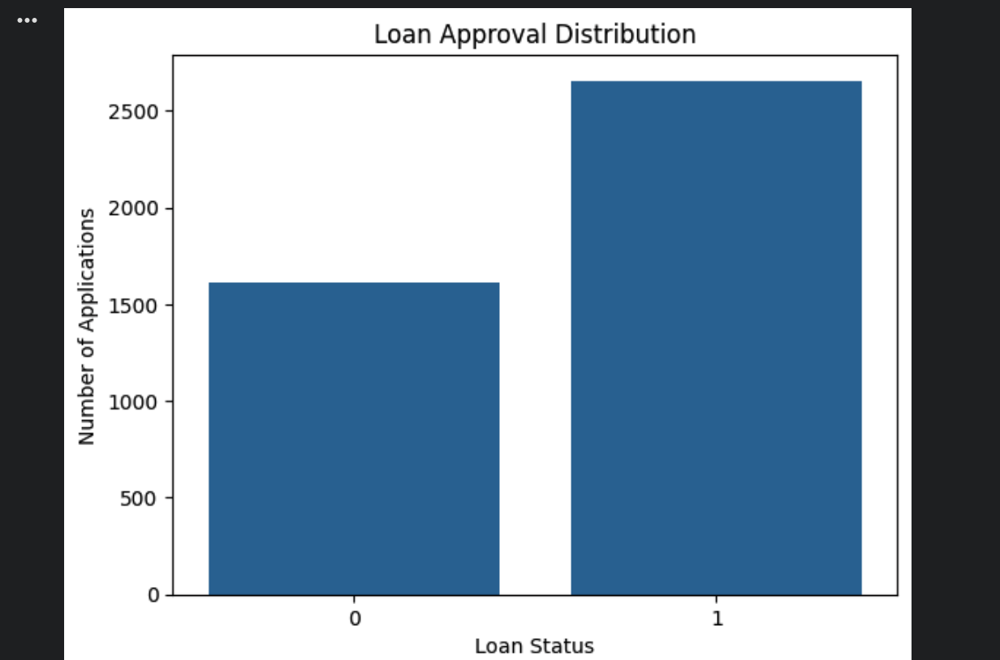
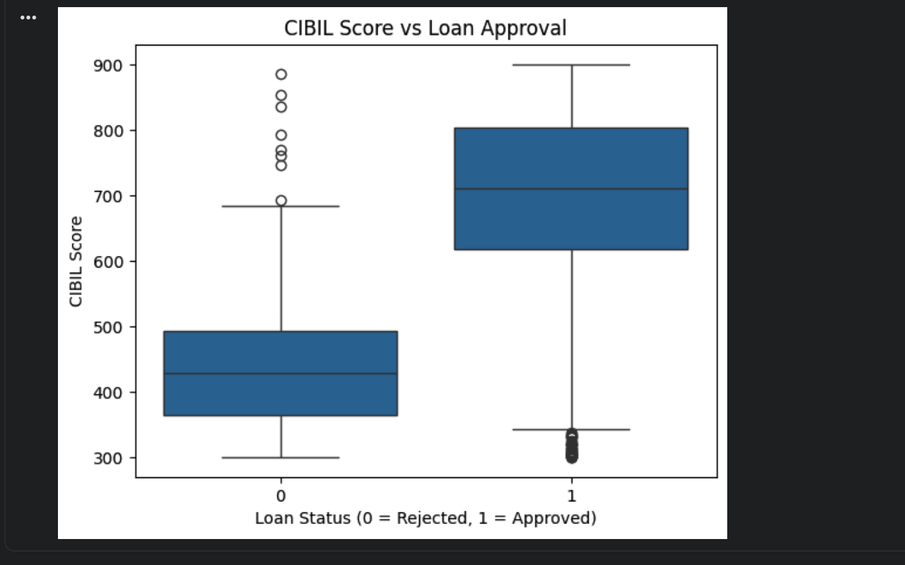
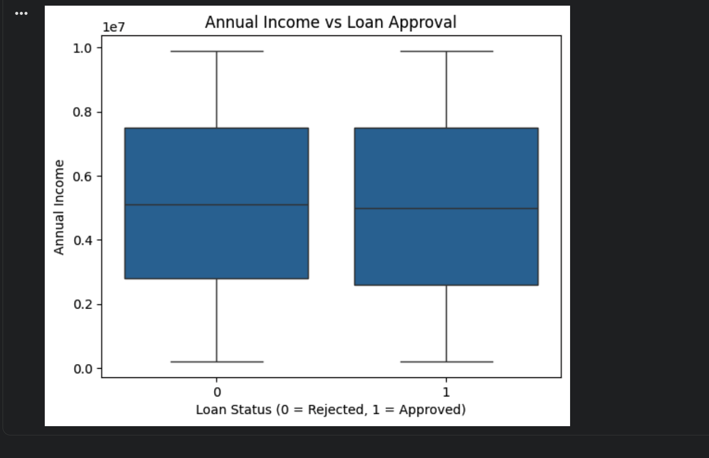
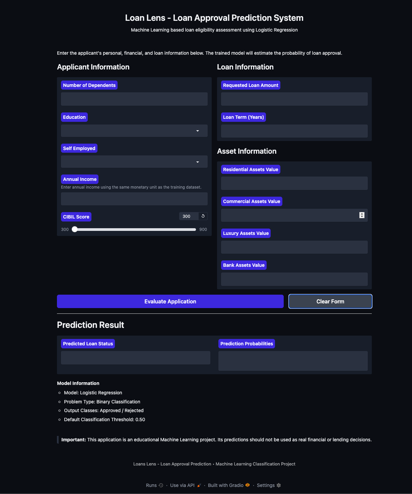
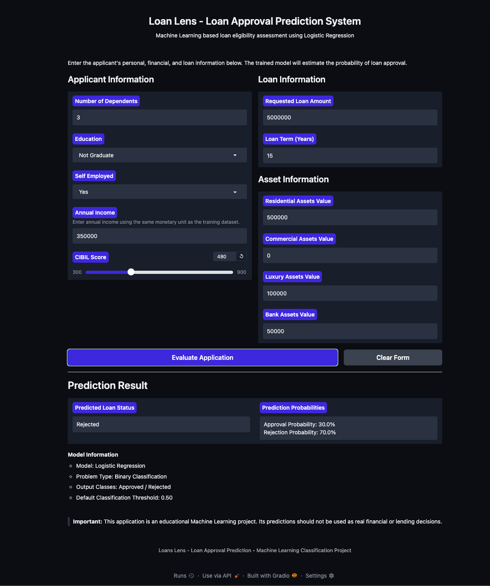

# Loan Lens — Loan Approval Prediction

Loan Lens is an end-to-end Machine Learning project that predicts whether
a loan application is likely to be approved or rejected.

The project uses Logistic Regression and provides an interactive Gradio
application where users can enter applicant information and receive a
predicted loan status and approval probability.

## Project Overview

The goal of Loan Lens is to demonstrate the complete Machine Learning
workflow, from understanding a real-world problem to deploying a working
prediction application.

The project covers:

- Problem definition
- Dataset collection and exploration
- Data cleaning and preprocessing
- Exploratory Data Analysis (EDA)
- Model training
- Model evaluation
- Prediction on unseen data
- Interactive application development
- Deployment

## Problem Statement

Loan approval is a binary classification problem.

The goal is to use applicant, financial, credit, and asset information
to predict one of two classes:

- Approved
- Rejected

The target variable is:

`loan_status`

## Dataset

The project uses a publicly available Loan Approval Prediction dataset.

The original dataset contains 4,269 records and 13 columns.

Important features include:

- Number of dependents
- Education
- Self-employment status
- Annual income
- Loan amount
- Loan term
- CIBIL score
- Residential assets value
- Commercial assets value
- Luxury assets value
- Bank asset value

The `loan_id` column was not used for model training because it is only
an identifier.

## Data Cleaning and Preprocessing

Before model training, the dataset was prepared by:

- Checking missing values
- Checking duplicate records
- Checking data types
- Cleaning categorical values
- Encoding categorical variables
- Removing the identifier column
- Separating features and target
- Splitting the dataset into training and testing sets
- Scaling numerical features using StandardScaler

The scaler was fitted using the training data and then applied to the
testing data.

## Exploratory Data Analysis

Exploratory Data Analysis was performed to understand patterns and
relationships in the dataset.

### Loan Approval Distribution

The dataset contains both approved and rejected applications, with more
approved applications than rejected applications.

### CIBIL Score and Loan Approval

CIBIL score showed the strongest relationship with loan approval.
Its correlation with loan status was approximately 0.77.

Approved applicants generally had higher CIBIL scores than rejected
applicants.

### Annual Income and Loan Approval

Annual income showed very little direct linear relationship with loan
approval in this dataset.

## Machine Learning Model

Logistic Regression was selected because Loan Approval Prediction is a
binary classification problem.

The dataset was divided into:

- 80% training data
- 20% testing data

The training features were standardized using StandardScaler before
training the Logistic Regression model.

## Model Evaluation

The trained model was evaluated using:

- Accuracy
- Precision
- Recall
- F1 Score
- Confusion Matrix
- ROC-AUC

### Evaluation Results

| Metric | Score |
| --- | ---: |
| Accuracy | 92.62% |
| Precision | 0.89 |
| Recall | 0.92 |
| F1 Score | 0.90 |
| ROC-AUC | 0.93 |

## Loan Lens Application

The trained model was integrated into an interactive application using
Gradio.

The application accepts:

- Applicant information
- Education
- Employment information
- Annual income
- Requested loan amount
- Loan term
- CIBIL score
- Asset information

It returns:

- Predicted loan status
- Approval probability

### Application Interface

### Approved Prediction Example

### Rejected Prediction Example

## Project Structure

    Loan-Lens/
    ├── app.py
    ├── README.md
    ├── requirements.txt
    ├── data/
    │   └── LoanLens.csv
    ├── images/
    ├── models/
    │   ├── logistic_regression_model.pkl
    │   └── scaler.pkl
    └── notebooks/
        └── LoanLens.ipynb

## Technologies Used

- Python
- Pandas
- NumPy
- Matplotlib
- Seaborn
- Scikit-learn
- Logistic Regression
- StandardScaler
- Gradio
- Google Colab
- Git
- GitHub

## Running the Project Locally

Clone the repository:

    git clone https://github.com/MuhammadZaeem500/Loan-Lens.git

Move into the project:

    cd Loan-Lens

Create a virtual environment:

    python3 -m venv .venv

Activate it on macOS/Linux:

    source .venv/bin/activate

Install the required packages:

    pip install -r requirements.txt

Run the application:

    python app.py

The application will normally become available at:

    http://127.0.0.1:7860

## Limitations

- The model was trained using a single publicly available dataset.
- Model predictions depend on the quality and characteristics of the
  training data.
- Logistic Regression is the only classification algorithm used in the
  current version.
- The model may not represent the lending rules used by real financial
  institutions.
- Fairness and bias across different groups have not yet been fully
  evaluated.
- The application is an educational Machine Learning project and should
  not be used for real lending decisions.

## Future Improvements

Future versions could include:

- Comparison with other classification algorithms
- Hyperparameter tuning
- Additional feature engineering
- Cross-validation
- Model explainability
- Fairness and bias analysis
- Improved UI
- API development
- Model monitoring

## Live Demo

Front End - https://loan-lens-sage.vercel.app/
Back End - https://loan-lens-0jbw.onrender.com/api

## Disclaimer

Loan Lens was developed for educational and portfolio purposes.

The predictions produced by this application should not be used to make
real financial or lending decisions.